<p align="center">
  
</p>

<p align="center">
  
</p>

<p align="center">
  <a href="https://hakandemir.com.tr"></a>
  <a href="https://linkedin.com/in/realhdemir"></a>
  <a href="mailto:a.hakandemir23@gmail.com"></a>
</p>

```text
hakan@github:~$ neofetch

  ██╗  ██╗██████╗     hakan@github
  ██║  ██║██╔══██╗    ------------
  ███████║██║  ██║    name       Hakan Demir
  ██╔══██║██║  ██║    role       full-stack developer
  ██║  ██║██████╔╝    builds     web · mobile · desktop · AI tools
  ╚═╝  ╚═╝╚═════╝     location   Ankara, TR
                      uptime     2+ years shipping products
                      langs      TypeScript · JavaScript · Rust · Python
                      status     open to remote work
```

```text
hakan@github:~$ cat about.txt
I build products end to end: React / Next.js on the web, React Native + Expo
on mobile, Electron on the desktop, Node.js and Rust behind them.
Lately: AI tooling, LLM workflows, MCP servers, scrapers and bots that
automate the boring parts.
```

```text
hakan@github:~$ cat stack.txt
lang       typescript  javascript  rust  python  swift
web        react  next.js  vite  tailwind  three.js
mobile     react-native  expo  eas
desktop    electron
backend    node.js  express  fastify
data       postgres  mongodb  redis  prisma  supabase  firebase
ai         openrouter  openai  mcp
infra      docker  vercel  railway  github-actions
```

```text
hakan@github:~$ ls -l ~/projects
```

| perms | name | type | what it does |
| :-- | :-- | :-- | :-- |
| `drwxr‑xr‑x` | [**gitfut**](https://github.com/HDemir23/gitfut) | `web` | GitHub stats as a World-Cup-style player card · next.js |
| `drwxr‑xr‑x` | [**mcptree**](https://github.com/HDemir23/mcpProvide-Frontend) | `web` | Drag-and-drop workflow builder for AI agents · next.js |
| `drwxr‑xr‑x` | [**veresiye-defteri**](https://github.com/HDemir23/Veresiye-Defteri-Demo-app) | `web` | Credit ledger for restaurants with PDF / Excel reports · react |
| `drwxr‑xr‑x` | [**clawaifu**](https://github.com/HDemir23/Clawaifu) | `web` | Terminal boot that becomes an AI-driven 3D character · three.js |
| `drwx‑‑‑‑‑‑` | **vitadraft** | `mobile` | AI-assisted resumes and cover letters · expo |
| `drwx‑‑‑‑‑‑` | **expenses-app** | `mobile` | Expense tracker with live currency rates · expo |
| `drwx‑‑‑‑‑‑` | **suna** | `desktop` | AI rule console for OpenRouter models, with MCP tools · electron |
| `drwxr‑xr‑x` | [**trade-analyzer**](https://github.com/HDemir23/Telegram-Trade-Analyzer-Advicer) | `bot` | Telegram bot for AI market analysis and alerts · typescript |
| `drwx‑‑‑‑‑‑` | **ai-image-generator** | `cli` | Batch image-to-image CLI (OpenRouter, OpenAI, Runware) · typescript |
| `drwx‑‑‑‑‑‑` | **carscrapper** | `service` | Car-listing scraper with headless Chromium, in Docker · rust |

<sub><code>drwx------</code> = private repo · linked ones are public</sub>

```text
hakan@github:~$ ./stats.sh
```

<p align="center">
  
  
</p>

<p align="center">
  
</p>

<p align="center">
  
</p>

<p align="center">
  <picture>
    <source media="(prefers-color-scheme: dark)" srcset="https://raw.githubusercontent.com/HDemir23/HDemir23/output/github-snake-dark.svg" />
    <source media="(prefers-color-scheme: light)" srcset="https://raw.githubusercontent.com/HDemir23/HDemir23/output/github-snake.svg" />
    
  </picture>
</p>

```text
hakan@github:~$ exit
logout
Connection to github.com closed.
```
